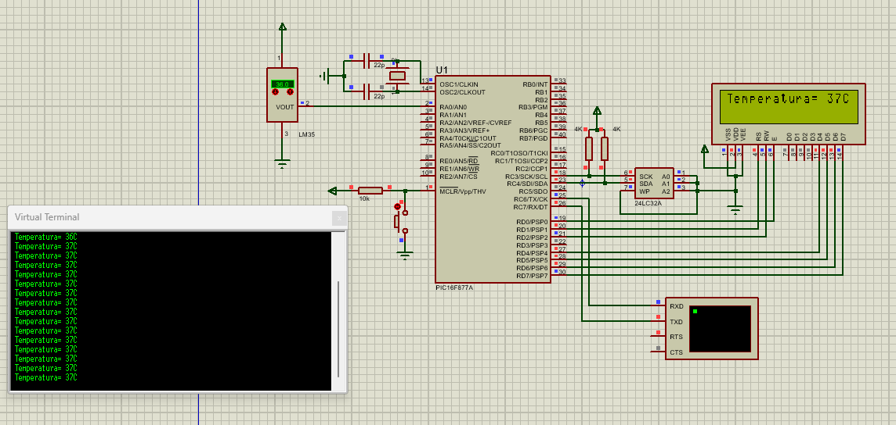

# `PIC16F877A` Almacenamiento de datos en Memoria con Temporizador Ajustable

Este proyecto utiliza un microcontrolador PIC16F877A para controlar una memoria que almacena datos. El tiempo de almacenamiento se puede ajustar de 1 a 60 segundos. Mediante RS-232 se puede configurar el tiempo o mostrar los datos almacenados.

## Componentes
- Microcontrolador: PIC16F877A
- Pantalla LCD 
- Sensor LM35
- Memoria EEPROM 24LC32A

## Herramientas de Desarrollo
- Proteus 11 para la simulación
- Lenguaje de programación: C

## Archivos del Proyecto
- `Código fuente` : "Reading_Storage_Temperature.c"
- Archivo .hex para la programación del microcontrolador
- Archivo .cof para depuración

## Diagrama de Conexión
- Se incluye una imagen PNG que muestra el diagrama de conexión entre los componentes
- También se añade la simulación realizada en Proteus

## Licencia
Este proyecto está bajo la licencia MIT. Consulta el archivo `LICENSE` para obtener más detalles.

-----------------------------------------------

# `PIC16F877A` Data Storage in Memory with Adjustable Timer

This project uses a PIC16F877A microcontroller to control a memory that stores data. The storage time can be adjusted from 1 to 60 seconds. Through RS-232, the time can be configured or the stored data can be displayed.

## Components
- Microcontroller: PIC16F877A
- LCD Screen
- LM35 Sensor
- EEPROM 24LC32A Memory

## Development Tools
- Proteus 11 for simulation
- Programming language: C

## Project Files
- `Source code` : “Reading_Storage_Temperature.c”
- .hex file for microcontroller programming
- .cof file for debugging

## Connection Diagram
- A PNG image is included that shows the connection diagram between the components
- The simulation performed in Proteus is also added

## License
This project is under the MIT license. Check the LICENSE file for more details.

-----------------------------------------------

 

